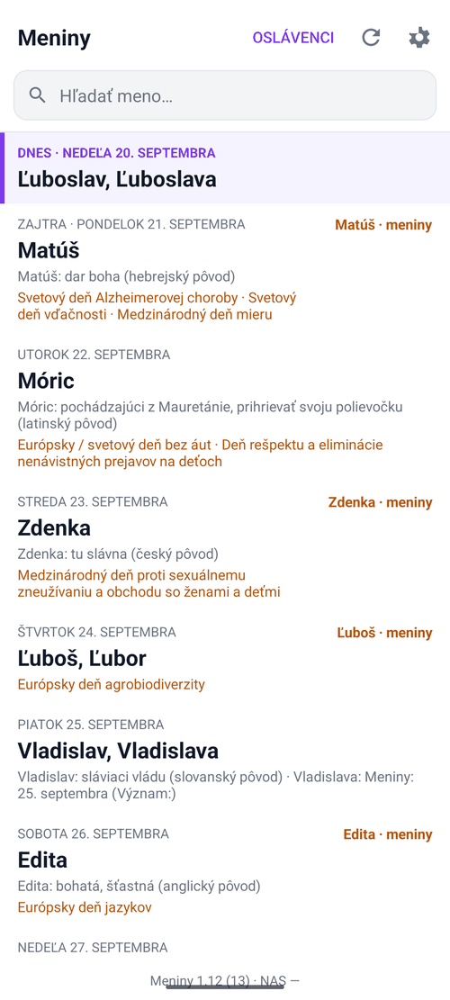
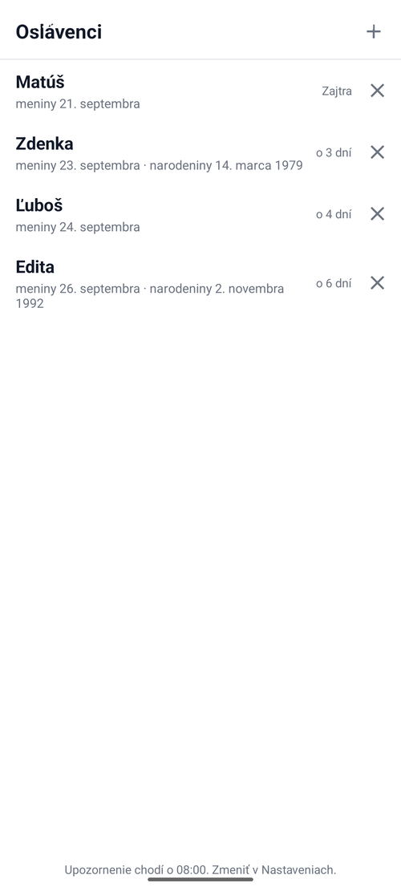
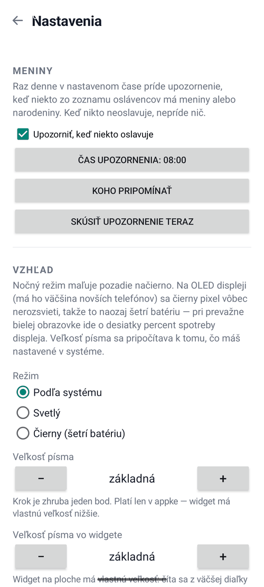

# Meniny (Name days)

In Slovakia people celebrate their *name day* — every day of the calendar
belongs to one or two first names, and forgetting your mother's is about as bad
as forgetting her birthday. This app shows who celebrates today and in the next
days, lets me search a name, puts it on the home screen as a widget, and
reminds me once a day about the people I care about — name days and birthdays.

No ads, no account. It goes to the network only to check for its own update.

Android · Kotlin · home-screen widget · minSdk 26 · Kotlin + Python tests

## What it looks like

| Today and the days after | The people I watch | Settings |
|---|---|---|
|  |  |  |

Every day carries the meaning and origin of the name and the international days
that fall on it. The people I watch are marked in the orange column on the
right, so the list answers "is it anyone of mine?" without opening anything.
They are sorted by the nearest celebration, not alphabetically — whoever is
celebrating tomorrow is at the top, not in the middle.

The interface is Slovak; so is the calendar. The four people in the screenshot
are made up.

## How it works

The calendar is shipped **inside the APK as an asset**, not downloaded. It
practically does not change from year to year, the widget has to show today
without signal, and downloading ~900 kB of HTML on every start would be silly.

```
data/generuj_mena.py   →  app/src/main/assets/meniny.json  →  APK
   (on the PC)                     (57 kB)                  (phone)
```

The generator merges two websites and has its own traps, described in
[data/README.md](data/README.md) (in Slovak).

The Kotlin tests run **against the real asset**, not made-up input — so they
check the data itself, not just that the parser does not crash.

## Small things that were easy to get wrong

**The order of names must not be sorted.** The source puts the more common
name first. Alphabetical order would destroy that.

**A day without a name is valid.** 1 January, 1 May, 2 November, 18 and
25 December have only a holiday. That is not a data error.

**Search ignores diacritics**, and a match at the start of a name wins over a
match in the middle — typing "mar" should find Mária before Otmar.

**The widget counts its rows from its own height.** `RemoteViews` cannot be
built at runtime, so the layout has twelve fixed rows and the provider hides
the extra ones. Before, it always had four — empty space on a big widget,
cut-off rows on a small one.

**The reminder is an inexact alarm.** `setAndAllowWhileIdle` does not need
`SCHEDULE_EXACT_ALARM`, which Android 12+ asks for separately and which the user
can refuse — then an exact alarm silently never fires. A morning reminder can
live with a few minutes' delay. Only the next alarm is ever scheduled, and the
chain is rebuilt on app start, after a settings change and after a reboot.

**Nobody celebrating = no notification.** A daily "nobody has a name day today"
would be switched off within a week.

**29 February is celebrated on 1 March in a non-leap year.** Otherwise the
reminder would come once in four years — for exactly the person everybody
forgets anyway.

**The widget does not rely on `updatePeriodMillis`.** Its minimum is 30 minutes
and the system batches it, so after midnight the widget would show yesterday
for a long time. The provider also listens to `DATE_CHANGED`, `TIME_SET` and
`TIMEZONE_CHANGED`.

## Build and tests

```
./gradlew :app:assembleDebug
./gradlew :app:testDebugUnitTest
cd data && python -m pytest -q
```

It follows the same template as my other Android apps — same UI skeleton, same
self-update from my NAS — see [docs/shared-standard.md](docs/shared-standard.md).
The UI is in Slovak; the original README is in [README.sk.md](README.sk.md).
